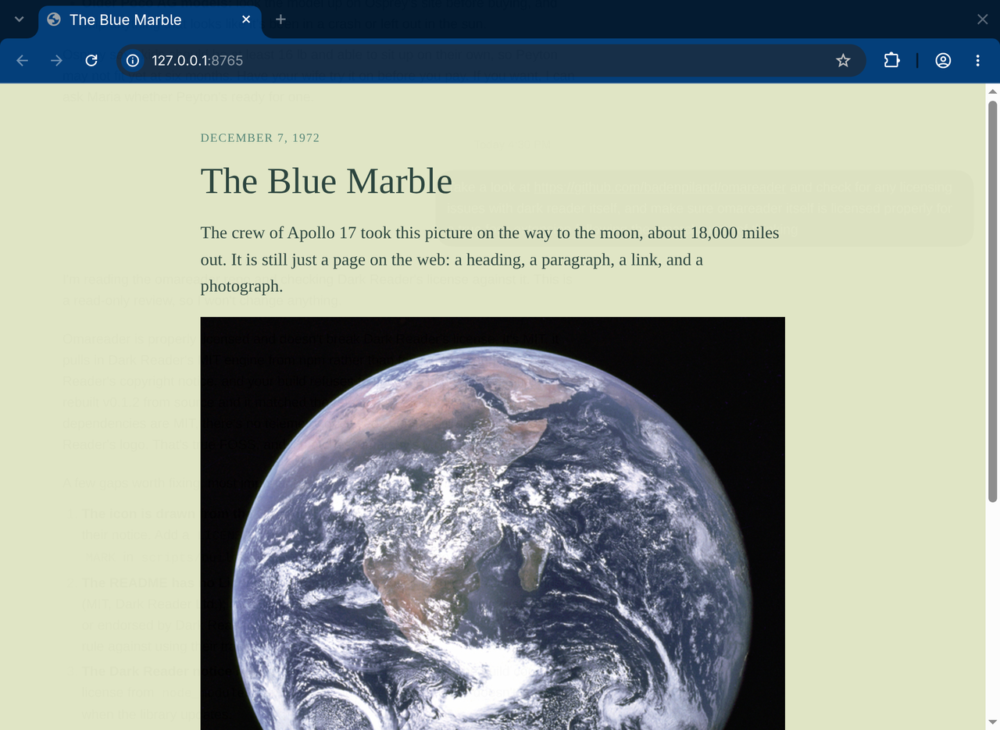
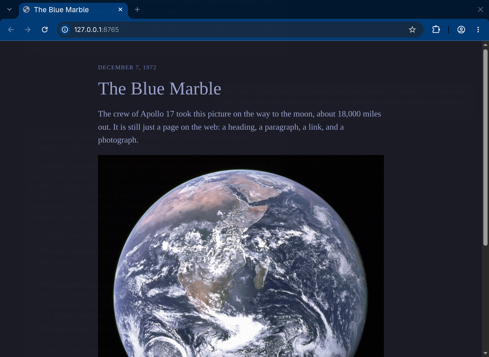
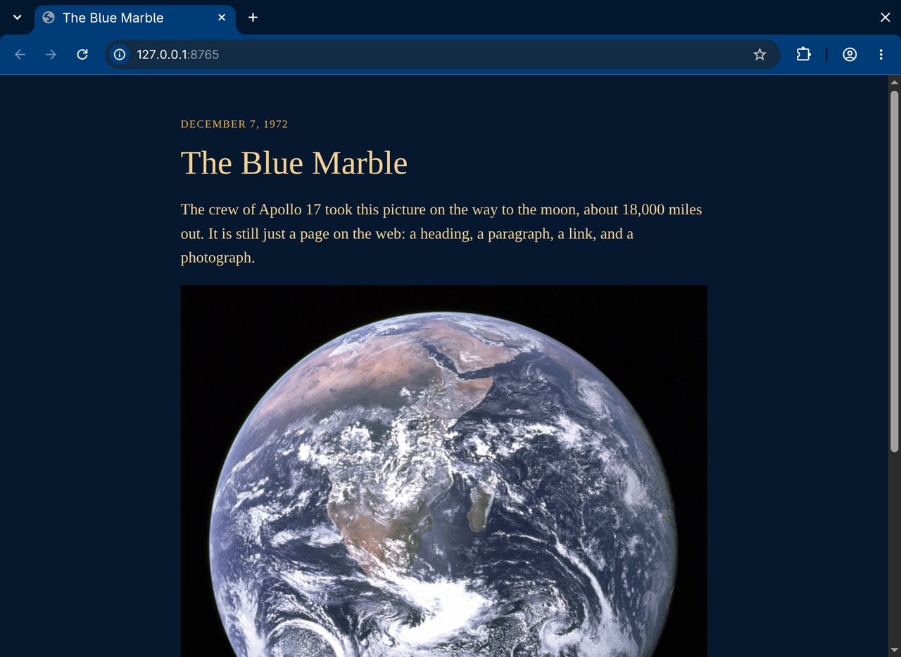

# Omareader

Web pages wear the Omarchy theme you already picked. Switch themes and the open tabs follow. Light stays light. The photograph stays a photograph.


```bash
git clone https://github.com/badenpiland/omareader.git
cd omareader
./install.sh
```

Restart the browser once.

The clip is Harbor, then Tokyo Night. [The same switch as a video](docs/switch.mp4).



Harbor.



Tokyo Night.



Retro 82.

## What it does

Omareader is a Chromium extension. A small Python program watches `~/.local/state/omarchy/current` and sends over the background, foreground, and selection color whenever `omarchy theme set` swaps that directory.

The painting is [Dark Reader](https://darkreader.org/)’s dynamic theme engine (`darkreader` 4.9.133, MIT, copyright Dark Reader Ltd). You do not install the Dark Reader extension. The first time Omareader starts, it turns that extension off, because two copies of the engine fight over the page. Turn it back on from `chrome://extensions` if you want it, and turn Omareader off.

Link and syntax colors stay on Dark Reader’s usual path. They are not replaced with the terminal’s red, green, and blue.

## Install

The installer registers Chromium, and any of Chrome, Brave, Brave Origin, and Edge that already have a config directory. The palette has to come from your machine, so it installs the extension and the native host together. The extension id is `mhglniaepbokfgnpeennihlifandcgjh`.

`install.sh` copies the host to `~/.local/share/omareader/` and downloads the signed extension for the version in `package.json`. It does not compile anything and it does not create a signing key.

## Limits

Per-site fixes from Dark Reader’s fix list are not included. `chrome://` pages and the Chrome Web Store cannot be themed. Zen is not wired up.

## Develop

```bash
npm install
npm test
npm run build
```

The public key in `src/manifest.json` pins the extension id. `key.pem` stays private and is how `scripts/pack.sh` signs `release/omareader.crx`. Do not generate a replacement key. A new key would publish a different extension id, and already-installed browsers would keep the old one.

Dark Reader’s license is `LICENSES/darkreader-MIT.txt`. The build copies it into the extension package.

## Omarchy

This is a pre-release. Inclusion in Omarchy is suggested here: https://github.com/omacom/omarchy/discussions/14632
