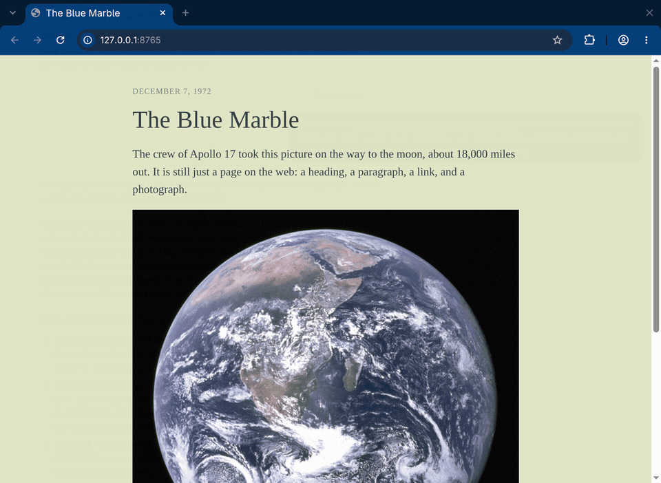

# Omareader

Web pages use the Omarchy theme you already picked. Switch themes and the open tabs follow. 



## What it does

Omareader is a Chromium extension. A small Python program watches `~/.local/state/omarchy/current` and sends over the background, foreground, and selection color whenever `omarchy theme set` swaps that directory.

The themeing is [Dark Reader](https://darkreader.org/)’s dynamic theme engine (`darkreader` 4.9.133, MIT, copyright Dark Reader Ltd). You do not install the Dark Reader extension. The popup asks once before turning it off. If Omareader cannot see other extensions yet, that question says so. Turning it off asks for permission to manage extensions. Leaving it on means both extensions restyle the page. Pages also get Dark Reader’s site fixes, so a site such as Amazon gets the same corrections Dark Reader ships for it. The bundled list is from Dark Reader 4.9.133. Once a day Omareader downloads Dark Reader's public site-fix list from raw.githubusercontent.com. No browsing data is sent. Uncheck “Update site fixes daily” in the popup to keep the list already in use. A failed download, or a list with a command this version does not know, also keeps the list already in use.

Alt+Shift+O turns Omareader on or off. The toolbar shows the dark glasses while it is on, and the light glasses while it is off. Pause on this site leaves that host alone and shows the light glasses on its tabs.

Link and syntax colors stay on Dark Reader’s usual path. They are not replaced with the terminal’s red, green, and blue.

## Install

The installer auto-installs the extension for Chromium, which is the browser Omarchy ships. Brave Origin on this machine also loads that per-user External Extensions folder, so it is registered the same way. Chrome, Edge, Brave, Brave beta, and Brave nightly were not installed here, so the installer does not claim they auto-install. For those, it still registers the native host when a config directory already exists, and you install the extension once: open `chrome://extensions`, turn on Developer mode, and drag in `~/.local/share/omareader/omareader.crx` (or load `dist/` unpacked). System-wide folders such as `/opt/google/chrome/extensions` need root and are left to you.

The palette has to come from your machine, so the extension and the native host are installed together. The extension id is `mhglniaepbokfgnpeennihlifandcgjh`.

`install.sh` copies the host to `~/.local/share/omareader/` and downloads the signed extension for the version in `package.json`. It does not compile anything and it does not create a signing key.

## Limits

`chrome://` pages and the Chrome Web Store cannot be themed.

## Build from source

```bash
npm ci
npm run build
# then load dist/ as an unpacked extension (chrome://extensions, Developer mode, Load unpacked)
```

The extension id stays `mhglniaepbokfgnpeennihlifandcgjh`, so the native host still works. `scripts/pack.sh` writes `release/omareader.crx` and `release/omareader.crx.sha256`. Upload both files to the GitHub release. `install.sh` checks that checksum when it is published, and warns if the `.sha256` file is missing.

```bash
npm run lint
npm test
```

GitHub Actions runs the lint, the tests, and the build on every push and pull request. It does not sign a release.

The public key in `src/manifest.json` pins the extension id. `key.pem` stays private and is how `scripts/pack.sh` signs `release/omareader.crx`. Do not generate a replacement key. A new key would publish a different extension id, and already-installed browsers would keep the old one.

The build refreshes `LICENSES/darkreader-MIT.txt` from `node_modules/darkreader/LICENSE` and copies it into the extension.

## Omarchy

This is a pre-release. Inclusion in Omarchy is suggested here: https://github.com/omacom/omarchy/discussions/14632

## License

MIT, see [LICENSE](LICENSE).

Bundles the Dark Reader engine (MIT, Copyright (c) Dark Reader Ltd.), see [LICENSES/darkreader-MIT.txt](LICENSES/darkreader-MIT.txt).
Icon derived from the Omarchy mark (MIT, Copyright (c) David Heinemeier Hansson), see [LICENSES/omarchy-MIT.txt](LICENSES/omarchy-MIT.txt).

Not affiliated with or endorsed by Dark Reader Ltd. or the Omarchy project.
